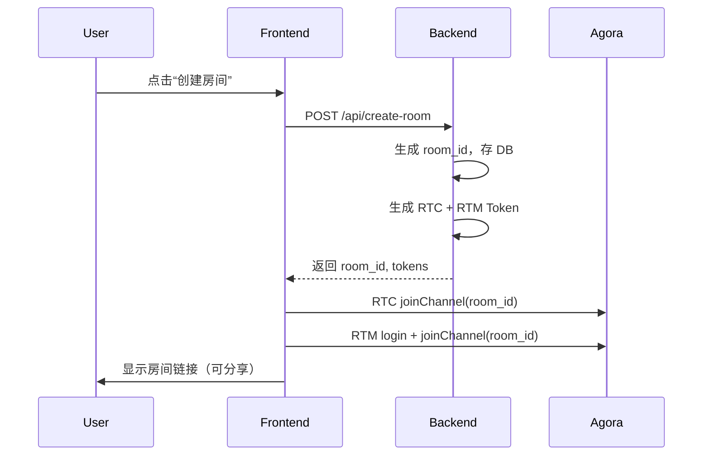
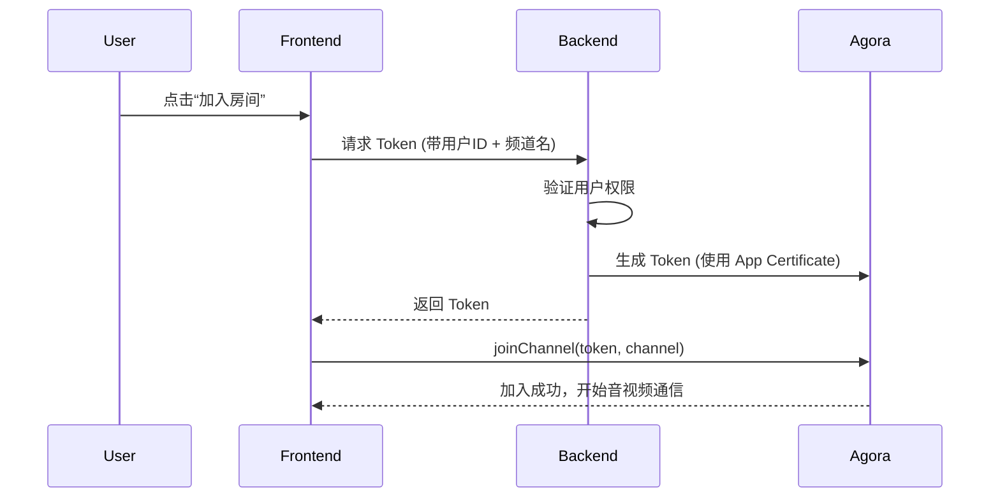
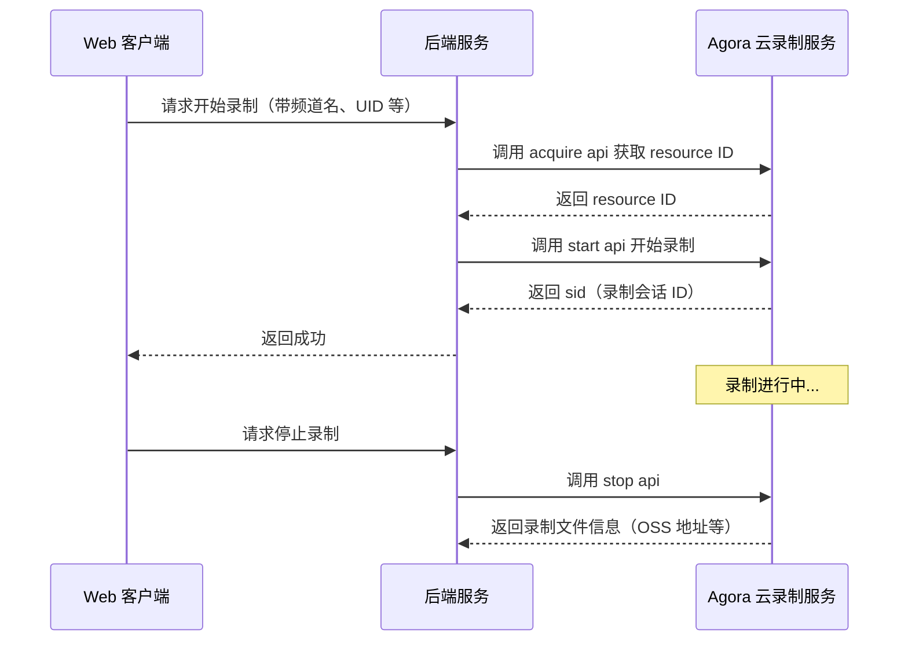

# 房间管理

## 创建房间

```mermaid
sequenceDiagram
    participant User
    participant Frontend
    participant Backend
    participant Agora

    User->>Frontend: 点击“创建房间”
    Frontend->>Backend: POST /api/create-room
    Backend->>Backend: 生成 room_id，存 DB
    Backend->>Backend: 生成 RTC + RTM Token
    Backend-->>Frontend: 返回 room_id, tokens
    Frontend->>Agora: RTC joinChannel(room_id)
    Frontend->>Agora: RTM login + joinChannel(room_id)
    Frontend->>User: 显示房间链接（可分享）

```

## 加入房间

```mermaid
sequenceDiagram
    participant User
    participant Frontend
    participant Backend
    participant Agora

    User->>Frontend: 点击“加入房间”
    Frontend->>Backend: 请求 Token (带用户ID + 频道名)
    Backend->>Backend: 验证用户权限
    Backend->>Agora: 生成 Token (使用 App Certificate)
    Backend-->>Frontend: 返回 Token
    Frontend->>Agora: joinChannel(token, channel)
    Agora-->>Frontend: 加入成功，开始音视频通信

```

# 录制流程

```mermaid
sequenceDiagram
    participant Client as Web 客户端
    participant Backend as 后端服务
    participant AgoraCloud as Agora 云录制服务

    Client->>Backend: 请求开始录制（带频道名、UID 等）
    Backend->>AgoraCloud: 调用 acquire api 获取 resource ID
    AgoraCloud-->>Backend: 返回 resource ID
    Backend->>AgoraCloud: 调用 start api 开始录制
    AgoraCloud-->>Backend: 返回 sid（录制会话 ID）
    Backend-->>Client: 返回成功
    Note over AgoraCloud: 录制进行中...
    Client->>Backend: 请求停止录制
    Backend->>AgoraCloud: 调用 stop api
    AgoraCloud-->>Backend: 返回录制文件信息（OSS 地址等）
```

# 获取录制文件

停止录制后，Agora 会返回录制文件的信息，包括 OSS 地址等。前端调用接口后，后端生成临时链接，返回给前端下载。